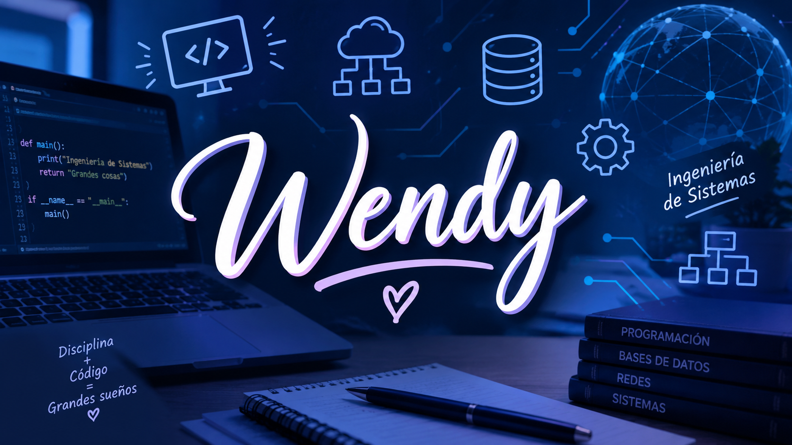

PORTAFOLIO PERSONAL

WENDY ESTEFANY MORAN PANTOJA

Estudiante de Ingeniería de Sistemas
Uniremington

INICIO

Bienvenidos a mi portafolio personal. Mi nombre es Wendy Estefany Moran Pantoja y soy estudiante de Ingeniería de Sistemas en Uniremington.

En este portafolio presento información sobre mi formación académica, mis intereses, las tecnologías que estoy aprendiendo y algunos de los proyectos que he realizado durante mi proceso de formación.

SOBRE MÍ

Mi nombre es Wendy Estefany Moran Pantoja. Actualmente soy estudiante de Ingeniería de Sistemas en Uniremington.

Soy una estudiante interesada en el área de tecnología y desarrollo de software. Durante mi formación académica he tenido la oportunidad de aprender diferentes conceptos relacionados con la programación, el desarrollo de aplicaciones, las bases de datos y el desarrollo web.

Me considero una persona responsable, dedicada y con disposición para aprender. Actualmente continúo fortaleciendo mis conocimientos mediante la realización de diferentes proyectos y ejercicios prácticos.

FORMACIÓN ACADÉMICA

Actualmente estudio Ingeniería de Sistemas en la Universidad Uniremington.

Durante mi carrera he aprendido conceptos relacionados con programación, bases de datos, desarrollo web, diseño de sistemas y herramientas utilizadas en el desarrollo de software.

TECNOLOGÍAS Y CONOCIMIENTOS

Actualmente me encuentro aprendiendo y fortaleciendo mis conocimientos en diferentes tecnologías y herramientas.

HTML: Estoy aprendiendo a utilizar HTML para crear la estructura de páginas web.

CSS: Estoy aprendiendo CSS para diseñar y dar estilo a las páginas web.

JavaScript: Estoy aprendiendo JavaScript para agregar funciones e interacción a las páginas web.

Java: Estoy aprendiendo los fundamentos de programación utilizando el lenguaje Java.

MySQL: Estoy aprendiendo a crear y administrar bases de datos, tablas y consultas utilizando MySQL.

Git: Estoy aprendiendo a utilizar Git para controlar las diferentes versiones de los proyectos.

GitHub: Estoy aprendiendo a utilizar GitHub para almacenar, organizar y compartir mis proyectos y repositorios.

PROYECTOS

GESTOR ESTUDIANTIL

Nombre del proyecto:
Gestor Estudiantil

Descripción:

El Gestor Estudiantil es un proyecto académico realizado con el objetivo de crear una aplicación que permita administrar información relacionada con estudiantes.

En este proyecto se trabajó en el registro y organización de información de los estudiantes. Se planteó una estructura que permite ingresar datos, almacenarlos y posteriormente consultarlos.

Cómo se realizó:

Para realizar el proyecto se utilizaron conocimientos de programación y manejo de información. Primero se identificaron los datos que debía tener cada estudiante. Después se diseñó la estructura de la aplicación y se desarrollaron las funciones necesarias para registrar y mostrar la información.

Durante el desarrollo también se realizaron pruebas para verificar que los datos fueran ingresados y mostrados correctamente.

Qué se aprendió:

Con este proyecto se fortalecieron los conocimientos sobre programación, manejo de datos, creación de interfaces y organización de la información. También permitió comprender mejor cómo desarrollar una aplicación a partir de una necesidad específica.

Tecnologías utilizadas:

HTML
CSS
JavaScript
MySQL

Estado:

Proyecto académico realizado durante el proceso de formación.

APP DE VENTAS DE TIENDA

Nombre del proyecto:
Aplicación de Ventas de Tienda

Descripción:

La aplicación de ventas de tienda es un proyecto académico desarrollado con el propósito de crear un sistema que permita administrar información relacionada con los productos y las ventas de una tienda.

El proyecto busca facilitar el registro y manejo de productos y permitir organizar la información relacionada con las ventas realizadas.

Cómo se realizó:

Para desarrollar la aplicación primero se identificaron las necesidades principales de una tienda. Posteriormente se establecieron los datos que debían manejarse, como los productos y la información relacionada con las ventas.

Después se diseñó la interfaz de la aplicación y se programaron las funciones necesarias para ingresar, consultar y organizar la información.

También se realizaron pruebas para comprobar el funcionamiento de las diferentes partes de la aplicación.

Qué se aprendió:

Este proyecto permitió aplicar conocimientos de programación y bases de datos. También ayudó a comprender cómo se puede utilizar un sistema informático para solucionar necesidades de un negocio y organizar su información.

Tecnologías utilizadas:

HTML
CSS
JavaScript
MySQL

Estado:

Proyecto académico en desarrollo y aprendizaje.

PORTAFOLIO PERSONAL

Nombre del proyecto:
Portafolio Personal

Descripción:

El portafolio personal es un proyecto desarrollado para presentar mi información académica, mis conocimientos, las tecnologías que estoy aprendiendo y los proyectos que he realizado durante mi formación como estudiante de Ingeniería de Sistemas.

Cómo se realizó:

Para realizar el portafolio se organizó primero la información personal y académica. Después se definieron las diferentes secciones que tendría la página, como inicio, sobre mí, tecnologías, proyectos y contacto.

Posteriormente se creó la estructura de la página utilizando HTML y se trabajó en su diseño utilizando CSS. También se pueden utilizar funciones de JavaScript para agregar interacción a la página.

El contenido fue organizado de manera sencilla para que las personas que visiten el portafolio puedan conocer mi perfil académico y los proyectos que he realizado.

Qué se aprendió:

Con este proyecto se fortalecieron los conocimientos sobre desarrollo web, especialmente en la creación de estructuras con HTML y diseño con CSS. También permitió aprender cómo organizar información personal y académica dentro de una página web.

Tecnologías utilizadas:

HTML
CSS
JavaScript

Estado:

Proyecto en desarrollo.

REPOSITORIOS EN GITHUB

Nombre del proyecto:
Repositorios de proyectos académicos en GitHub

Descripción:

GitHub es utilizado para almacenar y organizar diferentes proyectos y ejercicios realizados durante mi formación como estudiante de Ingeniería de Sistemas.

En los repositorios se pueden encontrar proyectos académicos, ejercicios de programación y otros trabajos realizados durante el proceso de aprendizaje.

Cómo se realizó:

Para comenzar a utilizar GitHub se creó una cuenta y posteriormente se aprendió a crear repositorios para almacenar los proyectos.

Los archivos de los proyectos se organizan dentro de los repositorios y se utiliza Git para registrar los cambios realizados durante el desarrollo.

De esta manera se puede mantener un historial de los cambios y tener los proyectos organizados en un solo lugar.

Qué se aprendió:

Este proceso permitió aprender los conceptos básicos de control de versiones y el funcionamiento de Git y GitHub. También permitió comprender la importancia de mantener los proyectos organizados y contar con un espacio donde puedan ser consultados y compartidos.

Tecnologías utilizadas:

Git
GitHub

Estado:

En proceso de aprendizaje y actualización.

OBJETIVOS

Mi principal objetivo es continuar fortaleciendo mis conocimientos en Ingeniería de Sistemas y adquirir mayor experiencia en el desarrollo de software.

También quiero continuar aprendiendo diferentes lenguajes de programación, herramientas y tecnologías que me permitan desarrollar proyectos más completos.

A través de los proyectos académicos y personales espero mejorar mis habilidades de programación, bases de datos, desarrollo web y manejo de herramientas para el desarrollo de software.

CONCLUSIÓN

Este portafolio representa una parte de mi proceso de formación como estudiante de Ingeniería de Sistemas. Los proyectos realizados me han permitido aplicar los conocimientos aprendidos en clase y comprender de una manera más práctica cómo se desarrolla un proyecto de software.

Actualmente continúo aprendiendo y mejorando mis conocimientos en diferentes tecnologías. Mi propósito es seguir adquiriendo experiencia, desarrollar nuevos proyectos y prepararme para desempeñarme profesionalmente en el área de sistemas.